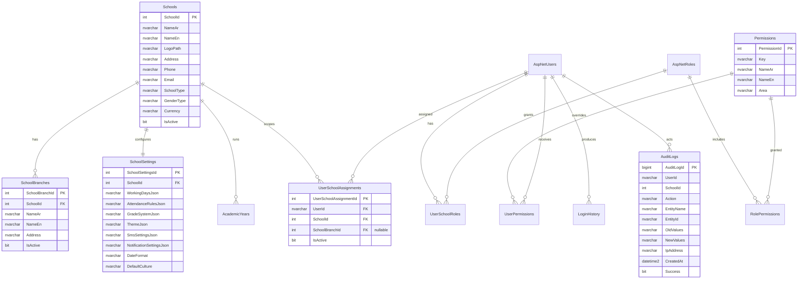
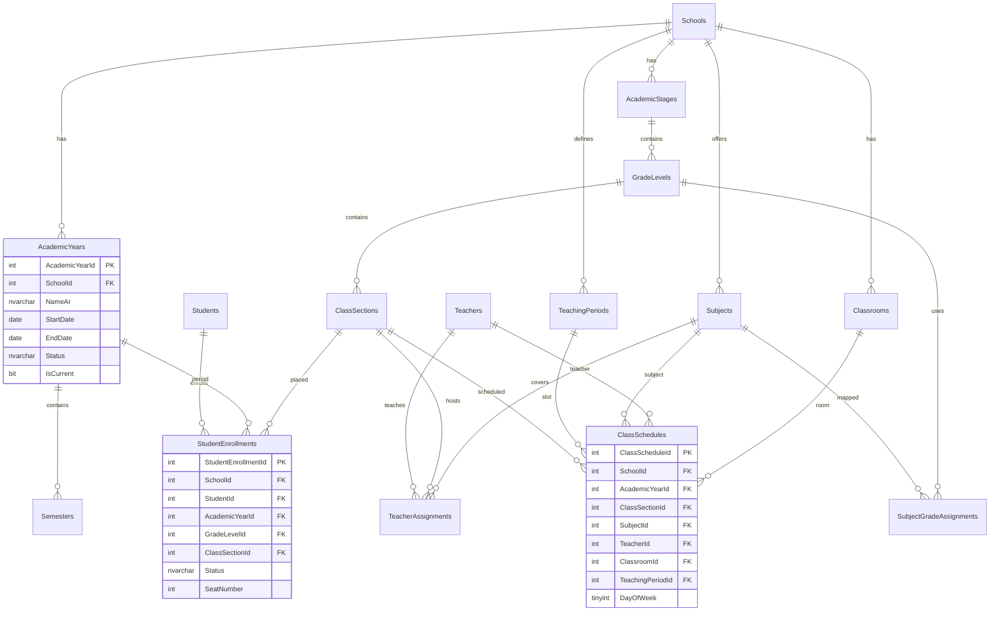
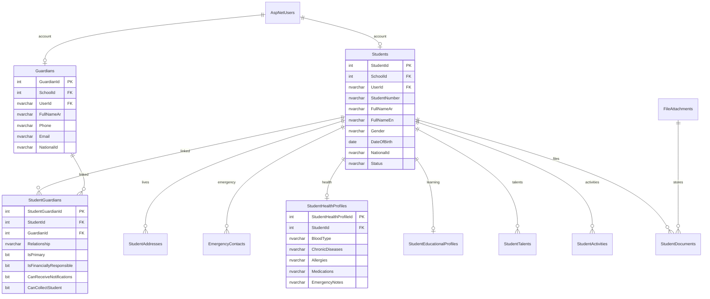
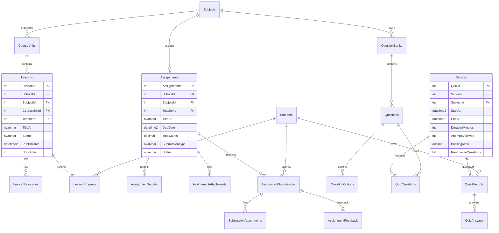
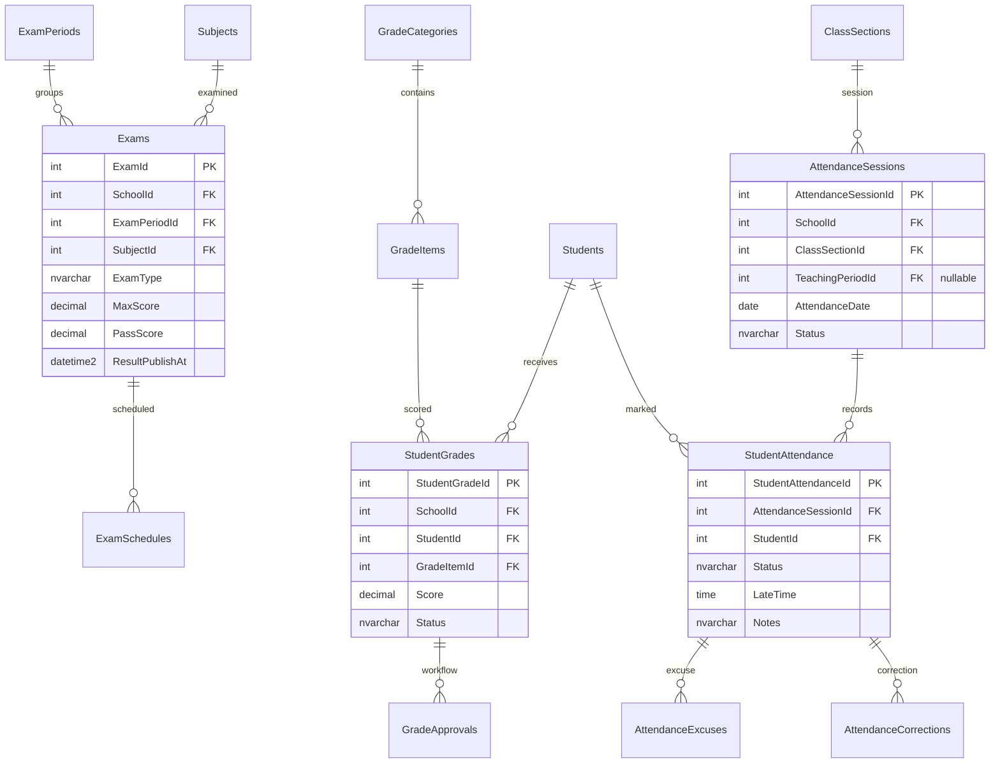
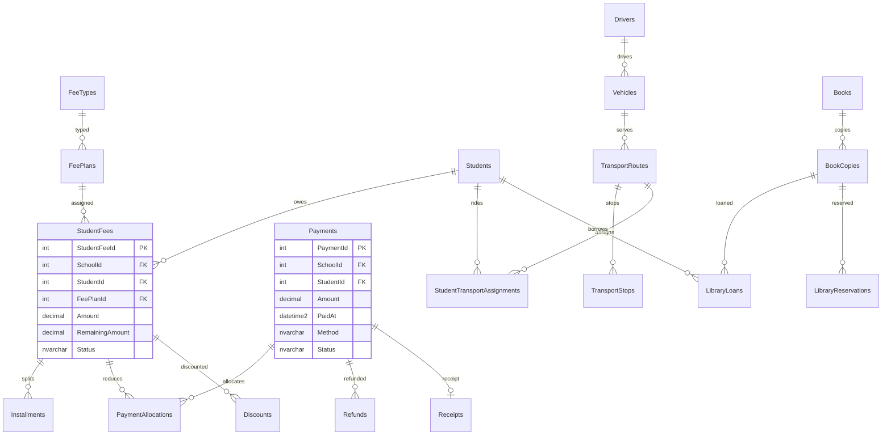

# Phase 1A — Database ERD

Logical ERD for Phase 1 design. Physical EF configurations and migrations follow in Phase 2.

Conventions:

- Every school-owned business table includes `SchoolId` (unless platform-global).
- Important tables include audit/soft-delete/`RowVersion` columns (omitted from diagrams for clarity).
- Money fields use `decimal(18,2)`.
- Text that may contain Arabic uses `NVARCHAR`.

## 1. Tenancy, identity, and access



## 2. Academic structure and enrollment



## 3. Students, guardians, and profiles



## 4. LMS: lessons, homework, quizzes



## 5. Exams, grades, attendance



## 6. Communication, behaviour, badges

```mermaid
erDiagram
    Announcements ||--o{ AnnouncementTargets : targets
    Events ||--o{ EventRegistrations : registrations
    NotificationTemplates ||--o{ Notifications : renders
    Notifications ||--o{ NotificationRecipients : delivers
    AspNetUsers ||--o{ UserDevices : devices

    BehaviourCategories ||--o{ BehaviourRecords : classifies
    Students ||--o{ BehaviourRecords : about
    Students ||--o{ CounsellingSessions : attends
    CounsellingSessions ||--o{ FollowUpPlans : plans

    Badges ||--o{ StudentBadges : awarded
    Students ||--o{ StudentBadges : earns

    Messages ||--o{ MessageRecipients : to
    Messages ||--o{ MessageAttachments : files

    Announcements {
        int AnnouncementId PK
        int SchoolId FK "nullable for global"
        nvarchar TitleAr
        nvarchar Priority
        datetime2 PublishAt
        datetime2 ExpireAt
        bit RequiresAck
        bit IsPinned
    }

    BehaviourRecords {
        int BehaviourRecordId PK
        int SchoolId FK
        int StudentId FK
        int BehaviourCategoryId FK
        date RecordDate
        int Points
        bit IsConfidential
        bit ParentNotified
        nvarchar Status
    }
```

## 7. Finance, transport, library



## 8. Key uniqueness and indexes

### Unique constraints (examples)

| Rule | Constraint idea |
|------|-----------------|
| Student number unique per school | `UQ_Students_SchoolId_StudentNumber` |
| One active enrollment per student per year | filtered unique on `(StudentId, AcademicYearId)` where active |
| One attendance mark per student per session | `UQ_StudentAttendance_Session_Student` |
| One active submission per attempt | `(AssignmentId, StudentId, AttemptNumber)` |
| Permission key unique | `UQ_Permissions_Key` |
| Role name unique | Identity default |

### Index priorities

`SchoolId`, `AcademicYearId`, `StudentId`, `TeacherId`, `Guardian`/`ParentUserId`, `GradeLevelId`, `ClassSectionId`, `SubjectId`, `CreatedAt`, `Status`, `DueDate`, `ExamDate`, `AttendanceDate`.

## 9. Seed data (Phase 2 preview)

- 1 Super Administrator
- 4 sample schools (Arabic names)
- Academic year current + previous
- Stages/grades/sections sample
- Roles + full permission catalog + default role grants
- Demo teacher, student, parent linked to one school
- Sample fee types and badge categories
