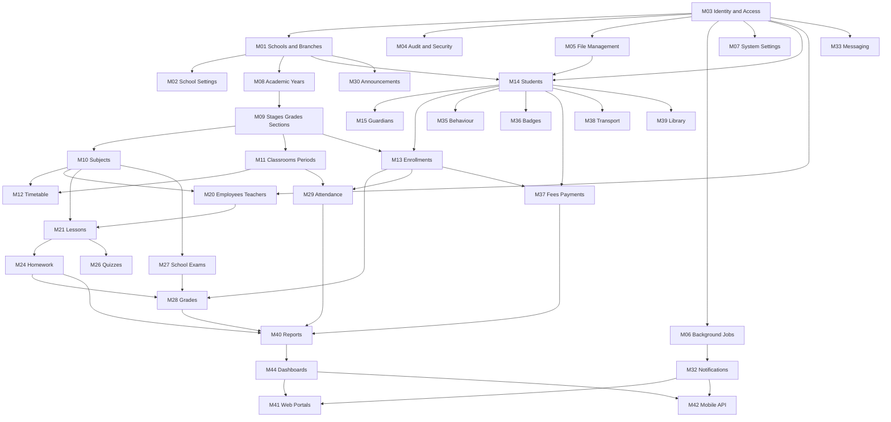

# Phase 1A — Module Dependencies

## 1. Dependency graph (build order)

Lower layers must exist before upper modules can be implemented safely.

## 2. Hard dependencies (cannot skip)

| Module | Depends on |
|--------|------------|
| Any school-owned module | M01 Schools, M03 Identity |
| Enrollments | Students, Grades/Sections, Academic Years |
| Timetable | Sections, Subjects, Teachers, Periods, Classrooms |
| Lessons / Homework / Quizzes | Subjects, Teachers, Enrollments (for targeting) |
| Grades | Enrollments, Subjects; optionally Exams/Homework/Quizzes as sources |
| Attendance | Sections, Students, Periods (for period mode) |
| Payments | Students, Fee plans; Enrollment often used for grade-based fee assignment |
| Parent portal child switcher | Guardians ↔ Students links |
| Notifications | Identity users + templates + jobs |
| Reports | Underlying transactional modules |
| Dashboards | Read models/services from many modules |

## 3. Soft / provider dependencies

| Capability | Abstraction | Initial provider | Later |
|------------|-------------|------------------|-------|
| Files | `IFileStorage` | Local disk | Azure Blob |
| Email | `IEmailSender` | SMTP / stub | Production SMTP |
| SMS | `ISmsSender` | Stub / configurable | Local Iraqi gateway |
| Push | `IPushSender` | Stub | Firebase |
| WhatsApp | `IWhatsAppSender` | Stub | Authorized API |
| Online payments | `IPaymentGateway` | Manual cashier first | Card gateway |
| CAPTCHA | `ICaptchaService` | Dev bypass | Production provider |
| Malware scan | `IFileScanner` | No-op hook | AV integration |

## 4. Circular dependency prevention

- Domain entities reference each other only through explicit FKs; no service calls in Domain.
- Application services may call other Application services carefully; prefer domain events / orchestration services for cross-module workflows (example: absence → notify parents).
- Web/Api never reference each other.
- Reports read via dedicated query services; they do not write operational data.

## 5. Suggested vertical-slice priority inside each phase

1. Entities + EF config + migration  
2. Seed / sample Arabic data  
3. Application service + validators  
4. Authorization checks  
5. Web UI pages  
6. API endpoints (where in scope)  
7. Tests (permission + service)  
8. Compile verification
